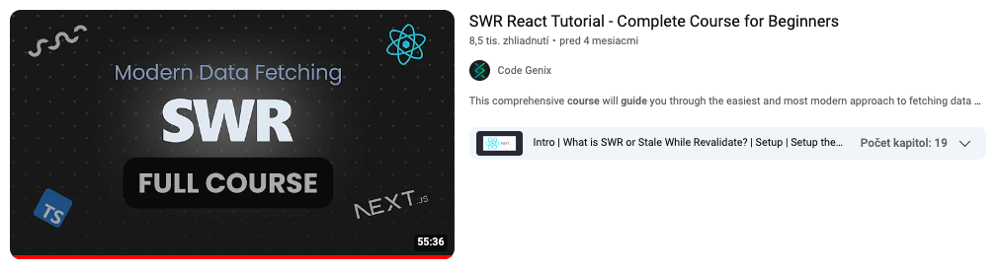

## Course on SWR

### Configuration

- use SWR by defining a fetcher function and calling useSWR hook
- configure SWR globally using the SWRConfig component

### Queries

- create basic query that fetches users
- create chainer or nested query that fetches cart informations

### Mutations

- create new products mutation with optimistic Ui

In the context of frontend development with React and API fetching, "mutation" typically refers to operations that change or update data on the server, as opposed to "queries," which are used to retrieve data. 

### Middleware

- add to products custom middleware that will log something to console

Middleware allows you to enhance and control the data fetching process by adding functionalities like logging, error handling, authentication, and data transformation. 

### Pagination

- impliment pagination on posts

### Infinite Scroll

- create infinite scroll on todos with useSWRInfinite hook
